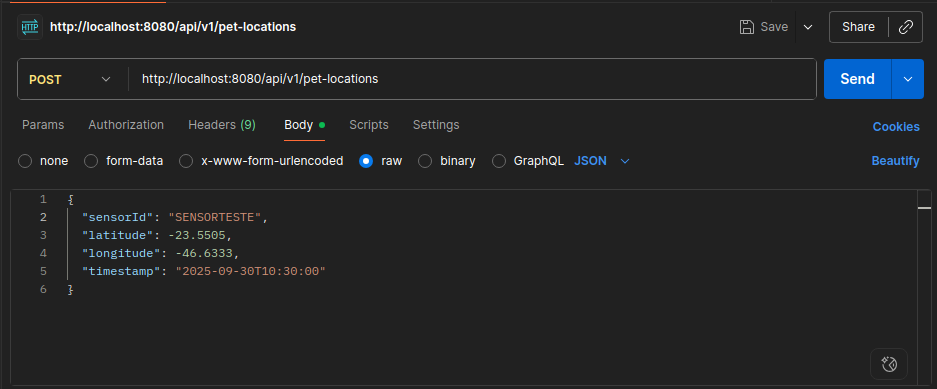
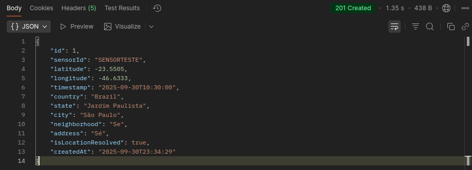
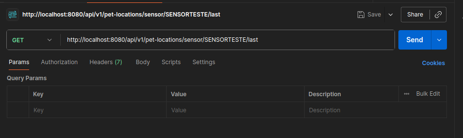
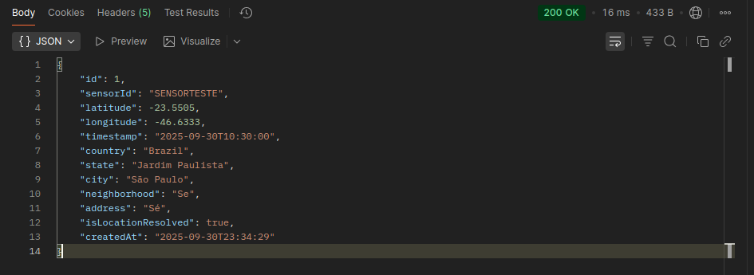
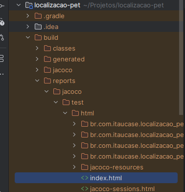
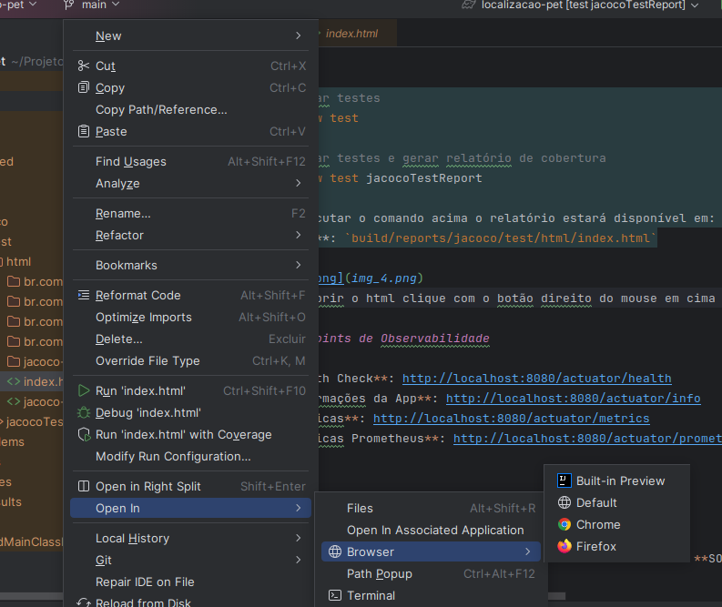
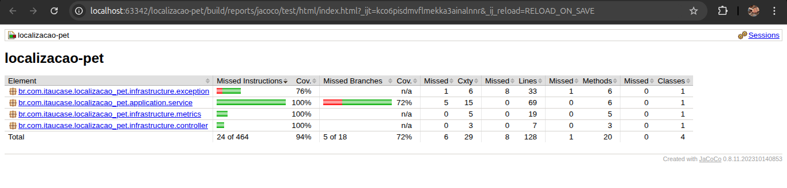

# API de localização de Pets

API REST para localização de pets perdidos durante acionamento de sinistro de seguro Pet.

## Visão Geral

Esta API foi desenvolvida como parte de um case técnico para facilitar a localização de pets perdidos. O sistema recebe dados de sensores (ID, latitude, longitude, timestamp) e retorna informações completas de localização incluindo país, estado, cidade, bairro e endereço.

## Funcionalidades do sistema

- Registro de localizações de pets via sensores
- Resolução automática de endereços através da PositionStack API
- Consulta da última localização de um pet
- Validação de dados de entrada
- Testes unitários e de integração com cobertura de código (JaCoCo)
- Observabilidade (métricas, logs e health checks)

## Tecnologias utilizadas

- **Java 17** - Linguagem de programação
- **Spring Boot 3.5.6** - Framework principal
- **Spring Data JPA** - Persistência de dados
- **Spring Cloud OpenFeign** - Cliente HTTP
- **H2 Database** - Banco de dados em memória
- **Lombok** - Redução de boilerplate
- **JUnit 5** - Framework de testes
- **JaCoCo** - Cobertura de código
- **Spring Boot Actuator** - Observabilidade
- **Micrometer** - Métricas

## Como Executar

### Clonando repositório do git hub

```bash
  # Executar no terminal
git clone https://github.com/marinalira/case-tecnico-localizacao-pet-itau.git
```

### Pré-requisitos

- Java 17 ou superior
- Gradle 7+

### Executar a aplicação pelo terminal com o seguinte comando:

```bash
./gradlew bootRun
```
### Acessar a aplicação

- **API Base URL**: http://localhost:8080
- **H2 Console**: http://localhost:8080/h2-console
    - URL: `jdbc:h2:mem:testdb`
    - Username: `sa`
    - Password: `password`

## Endpoints da API

### 1. Registrar Localização de Pet

Recebe os dados do sensor e persiste a localização do pet. Automaticamente resolve o endereço completo através da API PositionStack.

```http
POST http://localhost:8080/api/v1/pet-locations
Content-Type: application/json

{
  "sensorId": "SENSORTESTE",
  "latitude": -23.5505,
  "longitude": -46.6333,
  "timestamp": "2025-09-30T10:30:00"
}
```
- **Configuração no postman**:



**Resposta (201 Created):**
```json
{
  "id": 1,
  "sensorId": "SENSORTESTE",
  "latitude": -23.5505,
  "longitude": -46.6333,
  "timestamp": "2025-09-30T10:30:00",
  "country": "Brazil",
  "state": "Jardim Paulista",
  "city": "São Paulo",
  "neighborhood": "Se",
  "address": "Sé",
  "isLocationResolved": true,
  "createdAt": "2025-09-30T23:34:29"
}
```


### 2. Buscar Última Localização

Retorna a última localização registrada de um pet específico (api feita caso um pet tenha mais de um registro, buscar a última)

```http
GET http://localhost:8080/api/v1/pet-locations/sensor/{sensorId}/last
```

**Exemplo:**
```http
GET http://localhost:8080/api/v1/pet-locations/sensor/SENSORTESTE/last
```
- **Configuração no postman**:



**Resposta (200 OK):**
```json
{
  "id": 1,
  "sensorId": "SENSORTESTE",
  "latitude": -23.5505,
  "longitude": -46.6333,
  "timestamp": "2025-09-30T10:30:00",
  "country": "Brazil",
  "state": "Jardim Paulista",
  "city": "São Paulo",
  "neighborhood": "Se",
  "address": "Sé",
  "isLocationResolved": true,
  "createdAt": "2025-09-30T23:34:29"
}
```


### Executar os testes pelo terminal com o seguinte comando:

```bash
# Executar testes
./gradlew test

# Executar testes e gerar relatório de cobertura
./gradlew test jacocoTestReport

Após executar o comando acima o relatório estará disponível em:
- **HTML**: `build/reports/jacoco/test/html/index.html`

# Verificar cobertura mínima (70%)
./gradlew jacocoTestCoverageVerification
```

- Para abrir o html clique com o botão direito do mouse em cima de index.html > Open in > Browser

- A página aberta será assim:

## Testes e Cobertura de Código

A aplicação possui **testes unitários e de integração** cobrindo:

### Testes Unitários
- **Service Layer** - Lógica de negócio
- **Controller Layer** - Endpoints REST
- **Validações** - Casos de erro e exceções
- **Métricas** - Verificação de observabilidade

Testam componentes isoladamente usando mocks:
- `PetLocationServiceTest` - 5 casos de teste
- `PetLocationControllerTest` - 4 casos de teste

### Testes de Integração
- **Fluxo completo** - Controller → Service → Repository → Database
- **Persistência** - Validação de dados no banco H2
- **Múltiplas localizações** - Busca da última localização correta
- **Health checks** - Endpoints de observabilidade
- **Validações end-to-end** - Erros e casos de sucesso
 
- Testam o fluxo completo da aplicação:
- `PetLocationIntegrationTest` - 7 casos de teste

### Relatório de Cobertura (JaCoCo)

O JaCoCo gera relatórios de cobertura de código automaticamente após os testes:
- **Localização**: `build/reports/jacoco/test/html/index.html`
- **Meta de cobertura**: 70% (configurado no build.gradle)
- **Exclusões**: DTOs, Entidades e classe Application são excluídas da análise

## Observabilidade

A aplicação implementa observabilidade básica usando Spring Boot Actuator e Micrometer.

### Endpoints de Observabilidade

- **Health Check**: http://localhost:8080/actuator/health
- Verifica o status da aplicação e suas dependências:

Resposta:
```json
{
  "status": "UP",
  "components": {
    "db": {"status": "UP"},
    "diskSpace": {"status": "UP"},
    "ping": {"status": "UP"}
  }
}
```
- **Informações da App**: http://localhost:8080/actuator/info
- **Métricas**: http://localhost:8080/actuator/metrics (Ver todas as métricas)
  http://localhost:8080/actuator/metrics/pet.locations.registered (Ver métrica específica)

- A aplicação registra as seguintes métricas (basta colocar no fim da rota acima:

1. **pet.locations.registered** - Total de localizações registradas
2. **pet.locations.resolved** - Total de localizações resolvidas com sucesso
3. **pet.api.errors** - Total de erros na API externa

- **Métricas Prometheus**: http://localhost:8080/actuator/prometheus
- Isso facilita a integração com ferramentas de monitoramento como Grafana.

### Logs Estruturados

A aplicação utiliza logging estruturado com SLF4J:
- **Nível padrão**: INFO
- **Formato**: `[timestamp] [thread] [level] [logger] - [mensagem]`
- **Principais eventos logados**:
    - Registro de novas localizações
    - Resolução de endereços
    - Erros de integração com API externa
    - Operações do repositório

## Arquitetura

A aplicação segue os princípios de **Clean Architecture** e **SOLID**:

```
src/
├── main/
│   ├── java/
│   │   └── br/com/itaucase/localizacao_pet/
│   │       ├── LocalizacaoPetApplication.java
│   │       ├── domain/
│   │       │   ├── entity/         # Entidades JPA
│   │       │   ├── dto/            # Objetos de transferência
│   │       │   └── repository/     # Interfaces de repositório
│   │       ├── application/
│   │       │   └── service/        # Lógica de negócio
│   │       └── infrastructure/
│   │           ├── controller/     # Controllers REST
│   │           └── client/         # Clientes externos (Feign)
│   └── resources/
│       └── application.properties  # Configurações
└── test/
    └── java/                       # Testes unitários
```

### Camadas da Aplicação

1. **Domain Layer** (Domínio):
   - Entidades: `PetLocation`
   - DTOs: `PetLocationRequest`, `PetLocationResponse`, `PositionStackResponse`
   - Repositórios: `PetLocationRepository`

2. **Application Layer** (Aplicação):
   - Services: `PetLocationService` - Contém a lógica de negócio

3. **Infrastructure Layer** (Infraestrutura):
   - Controllers: `PetLocationController` - Endpoints REST
   - Clients: `PositionStackClient` - Integração com API externa

## Decisões Técnicas

### 1. Clean Architecture
**Por quê?** Separação clara de responsabilidades facilita manutenção e testes.

### 2. Spring Boot com H2
**Por quê?** H2 em memória é ideal para desenvolvimento e demonstração. Em produção, seria substituído por PostgreSQL ou MySQL.

### 3. OpenFeign
**Por quê?** Simplifica a integração com APIs REST externas de forma declarativa.

### 4. Validação de Entrada
**Por quê?** Bean Validation garante que apenas dados válidos sejam processados.

### 5. Resolução Automática
**Por quê?** Ao salvar ou buscar uma localização, o endereço é resolvido automaticamente se ainda não foi.


## Validações Implementadas

- **Sensor ID**: Obrigatório, não pode ser vazio
- **Latitude**: Obrigatória, deve estar entre -90 e 90
- **Longitude**: Obrigatória, deve estar entre -180 e 180
- **Timestamp**: Obrigatório, formato ISO 8601

## Configuração

As principais configurações estão em `application.properties`:

```properties
# PositionStack API
positionstack.api.key=sua-chave-aqui

# Database H2
spring.datasource.url=jdbc:h2:mem:testdb
```

### **Importante - API PositionStack**

A resolução de endereços depende da API PositionStack. Se os campos `country`, `state`, `city` estiverem retornando `null`:

**Possíveis causas:**
1. **API Key inválida ou expirada** - A chave fornecida pode ter expirado
2. **Limite de requisições atingido** - Plano gratuito tem limite de requests
3. **API fora do ar** - Serviço pode estar temporariamente indisponível

**Como testar a API manualmente:**
```bash
curl "https://api.positionstack.com/v1/reverse?access_key=SUA_KEY&query=-23.5505,-46.6333&limit=1"
```

**Solução temporária para demonstração:**
A aplicação continua funcionando mesmo se a API falhar. A localização é salva com as coordenadas, mas sem o endereço resolvido (`isLocationResolved: false`).

**Para obter nova API Key:**
1. Acesse: https://positionstack.com/
2. Crie uma conta gratuita
3. Gere nova API key
4. Atualize em `application.properties`

**Desenvolvido para o case técnico Itaú - 2025**
